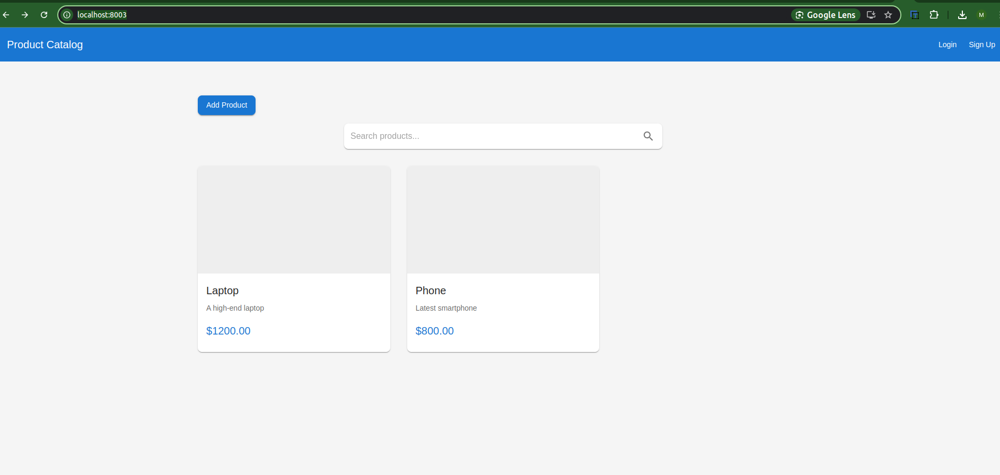
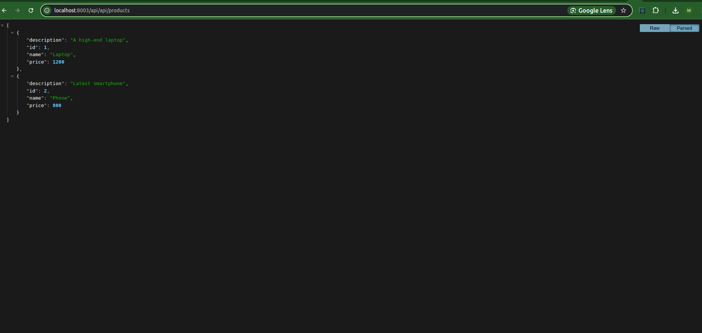
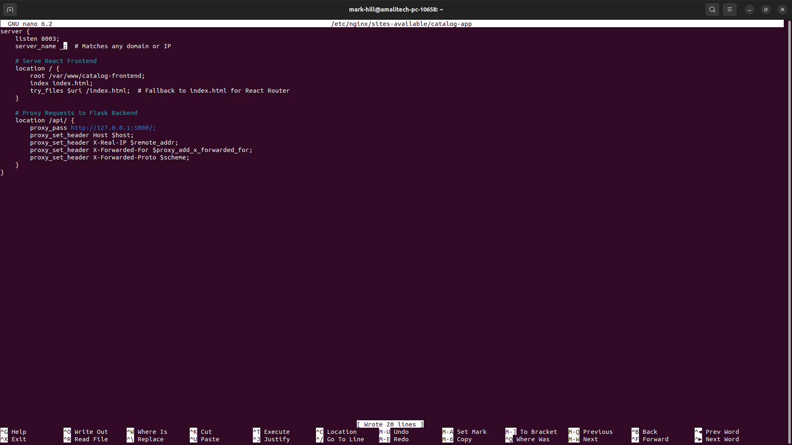

# Project Documentation

This project consists of a **React frontend** and a **Flask backend**, served using **Nginx** as a reverse proxy. The frontend is served as static files, while the backend handles API requests.

## Prerequisites

- **Node.js** and **npm** (for React frontend)
- **Python** and **pip** (for Flask backend)
- **Nginx** (for serving the frontend and proxying API requests)
- **Git** (optional, for version control)

## Frontend Setup (React)

1. Navigate to the React project directory:
   ```bash
   cd /path/to/react-project
   ```
2. Install dependencies:
   ```bash
   npm install
   ```
3. Start the React app:
   ```bash
   npm start
   ```

The frontend will run on **http://localhost:3001/**.



## Backend Setup (Flask)

1. Navigate to the Flask project directory:
   ```bash
   cd /path/to/flask-project
   ```
2. Create a virtual environment (optional but recommended):
   ```bash
   python3 -m venv venv
   source venv/bin/activate
   ```
3. Install dependencies:
   ```bash
   pip install -r requirements.txt
   ```
4. Run the Flask app:
   ```bash
   flask run --host=0.0.0.0 --port=5000
   ```

The backend will run on **http://localhost:5000/**.



## Nginx Configuration

1. Install Nginx:
   ```bash
   sudo apt update
   sudo apt install nginx
   ```
2. Create an Nginx configuration file:
   ```bash
   sudo nano /etc/nginx/sites-available/catalog-app
   ```
3. Add the following configuration:
   ```nginx
   server {
       listen 8003;
       server_name localhost;

       # Serve React Frontend
       location / {
           proxy_pass http://127.0.0.1:3001/;
           proxy_set_header Host $host;
           proxy_set_header X-Real-IP $remote_addr;
           proxy_set_header X-Forwarded-For $proxy_add_x_forwarded_for;
           proxy_set_header X-Forwarded-Proto $scheme;
       }

       # Proxy Requests to Flask Backend
       location /api/ {
           proxy_pass http://127.0.0.1:5000/;
           proxy_set_header Host $host;
           proxy_set_header X-Real-IP $remote_addr;
           proxy_set_header X-Forwarded-For $proxy_add_x_forwarded_for;
           proxy_set_header X-Forwarded-Proto $scheme;
       }
   }
   ```



4. Enable the configuration:
   ```bash
   sudo ln -s /etc/nginx/sites-available/catalog-app /etc/nginx/sites-enabled/
   sudo rm /etc/nginx/sites-enabled/default
   ```
5. Test the Nginx configuration:
   ```bash
   sudo nginx -t
   ```
6. Restart Nginx:
   ```bash
   sudo systemctl restart nginx
   ```

## Running the Application

1. Start the Flask backend:
   ```bash
   flask run --host=0.0.0.0 --port=5000
   ```
2. Start the React frontend:
   ```bash
   npm start
   ```
3. Access the application:
   - **Frontend:** [http://localhost:8003/](http://localhost:8003/)
   - **Backend API:** [http://localhost:8003/api/products](http://localhost:8003/api/products)

## Troubleshooting

### 1. Nginx Fails to Start
- Check the Nginx configuration for syntax errors:
  ```bash
  sudo nginx -t
  ```
- Check the Nginx logs:
  ```bash
  sudo tail -f /var/log/nginx/error.log
  ```

### 2. CORS Issues
Ensure the Flask backend allows requests from the frontend:
```python
from flask_cors import CORS
CORS(app, origins=["http://localhost:8003"])
```

### 3. React App Not Loading
- Ensure the React app is running on **port 3001**.
- Check the browser console for errors (F12 → Console tab).

## References
- [React Documentation](https://reactjs.org/)
- [Flask Documentation](https://flask.palletsprojects.com/)
- [Nginx Documentation](https://nginx.org/)
